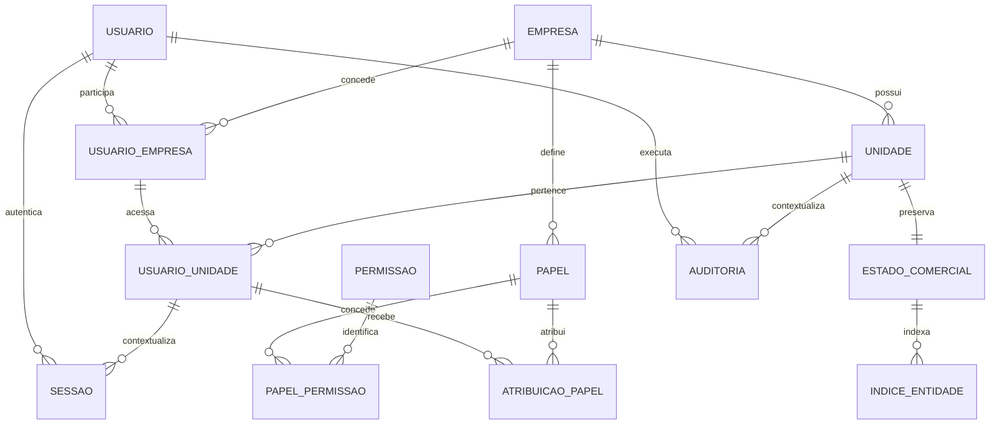

# Modelo conceitual da Fundação V1

Status: **APROVADO TECNICAMENTE** por Architect, Database e Security após o mapa do passo 2; implementar e testar as invariantes abaixo. A tarefa de vinte passos autoriza decisões técnicas fundamentadas; regras comerciais continuam A DEFINIR.

## Relações

## NOVO — identidade, ownership e acesso

| Entidade | Campos técnicos iniciais | Integridade |
| --- | --- | --- |
| Empresa | id, name, status, created_at, updated_at | PK; status ativo/inativo; nome obrigatório |
| Unidade | id, company_id, name, status, created_at, updated_at | PK composta company_id/id; FK empresa |
| Usuário | id, name, login, status, password_hash, created_at, updated_at | PK; login normalizado único; hash Argon2id versionado |
| Usuário↔Empresa | user_id, company_id, status | PK composta; FK usuário/empresa |
| Usuário↔Unidade | user_id, company_id, unit_id, status | FK composta unidade e vínculo de empresa |
| Papel | id, company_id, name | PK composta; não atravessa empresas |
| Permissão | code, description | Código global estável por ação |
| Papel↔Permissão | company_id, role_id, permission_code | FKs e chave única |
| Atribuição de papel | user_id, company_id, unit_id, role_id | FKs compostas para membro da unidade e papel da mesma empresa |
| Sessão | id, token_hash, user_id, company_id, unit_id, created_at, expires_at, last_seen_at, revoked_at | Token opaco só no cookie; hash único; contexto opcional antes da seleção; FK vínculo/unidade |
| Auditoria | id, user_id, company_id, unit_id, action, entity, record_id, before_json, after_json, executed_by, authorized_by, reason, date, prev_hash, entry_hash | FKs de identidade/escopo quando aplicáveis; append-only; sem secrets |

Sessões exigem company_id/unit_id ambos vazios ou ambos presentes, token_hash UNIQUE e FK (user_id,company_id,unit_id) para o vínculo de unidade. Chaves compostas impedem papel/unidade de outra empresa. Vínculos e entidades possuem status validado; estados têm revisão positiva e JSON válido.

Matriz/filial/depósito não terão regra especial neste escopo; unidade é uma entidade genérica. Cargo não é sinônimo de permissão. Usuários podem participar de múltiplas empresas e unidades. O bootstrap cria acesso inicial explicitamente, não senha fixa ou acesso global universal.

## JÁ EXISTE — comercial preservado

Cliente, fornecedor, produto, compra, estoque, venda, caixa e financeiro já existem como documentos/coleções do protótipo. Seus campos e históricos são detalhados em [schema legado](DATABASE_SCHEMA_V0.12.md). Ainda não são tabelas comerciais normalizadas.

Na transição, **unit_states(company_id, unit_id, revision, payload)** mantém snapshot validado das 42 coleções, com ownership relacional obrigatório. **entity_index(company_id, unit_id, kind, record_id)** permite localização explícita e testes de IDs, sem retirar o payload histórico. O snapshot por unidade preserva contratos atuais; não implementa catálogo compartilhado entre unidades. Compartilhamento e transferências entre unidades continuam A DEFINIR.

Referências comerciais internas são verificadas sobre somente o snapshot do escopo e pelos validadores existentes. Chaves compostas SQL protegem a fundação e seu índice; não alegar FK SQL para todos os campos dentro de JSON. Normalização comercial incremental é dívida técnica explícita.

## Invariantes de segurança e transação

- Toda consulta de estado/índice usa company_id e unit_id; corpo/query não escolhem tenant arbitrariamente.
- Sessão determina contexto após verificar vínculo. Usuário, empresa, unidade, papel e vínculos são revalidados em cada requisição.
- O snapshot completo contém financeiro. GET /api/state e respostas completas de mutação exigem todas as leituras: catalog.view, inventory.view, sales.view, financial.view, operations.view. As mutações exigem também sua permissão específica. A interface comercial atual não oferece leitura parcial por perfil nesta V1.
- Exports temporários pertencem à sessão e ao escopo, com verificação de permissão no download.
- Transação abrange leitura atual, regra de negócio, validação, revisão, snapshot, índice e auditoria. Só responder sucesso após commit.
- Auditoria antiga permanece declarada. A nova identifica executor verificado. authorized_by fica vazio quando não houve aprovação real; não inventar PIN/biometria ou liberador.
- Trilha append-only e encadeada detecta alterações simples; não é inviolável contra administrador do arquivo, nem possui âncora externa.
- Senha, cookie, token, hash de senha e código de instalação não entram no snapshot comercial, logs ou antes/depois de auditoria.

## Migração e preservação

Validar cópia, preservar IDs/campos desconhecidos/histórico/centavos, gerar relatório de contagens e totais, verificar igualdade canônica e hash de origem. Importação em transação, sem apagar ou sobrescrever database.json. Segunda importação idêntica reconhece resultado; origem alterada em banco já operante exige revisão, não sobrescrita silenciosa.

## Revisão técnica

Architect e Security: aprovados tecnicamente em revisão de mensagem, após cumprimento do mapa2 e com as constraints incorporadas acima. Database: aprovado tecnicamente após o mapa2. Bootstrap usa token aleatório de instalação, Host/Origin/JSON, exclusão de concorrência por transação e fechamento após primeiro usuário; status nunca expõe token. Auditoria pré-login pode ter escopo/ator nulos; isso não inventa usuário inexistente. authorized_by não é aceito do corpo sem aprovação verificada. Decisão e limitações serão registradas antes da primeira migration. Nenhuma aprovação comercial, fiscal, de PIN/biometria ou cloud está implícita neste modelo.

